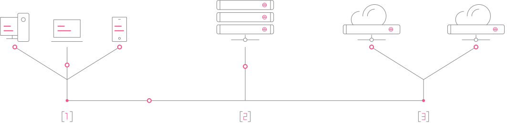

[](https://php.net/)
[](https://github.com/WWBN/AVideo/releases)

## Qtune LiveTV
LiveTV is an audio and video platform designed for easy Video Sharing , Visual Effects (VFX) and Multicasting with Video On Demand (VOD) and Pay-Per-View support brought to you by Qtune



1. Management Project(s): <a href="http://tv.qtune.io" class="" target="_blank">QtuneTV Platform</a>
1. Encoding Project(s): <a href="https://github.com/TommyTeaVee/Encoder" class="" target="_blank"> Encoder</a>

Management life cycle is as follows; media is managed at the platform at 1, media is then uploaded to a temporary storage to be encoded at 2, then stored for broadcast at 3, then distributed to devices at 1 to be consumed.

#### About Qtune's LiveTV Platform
LiveTV is a blockchain powered broadcast studio for your content and audience. Qtune icentivies all platform participants by rewarding both audience and content creators with crypto tokens called Gesturecoins. With Gesrturecoins integrated within the platform , creators can also have commercial services, you can create premium programs or channels, Video on Demand or Pay-Per-View. 


# Create Your Own Broadcast Network With Qtune LiveTV Platform

## Qtune's LiveTV Platform  Solution enables you to create your own Netflix like Broadcasting Studio. 
And more to come in 2022. Our mission is to take your video sharing site to "The Next Level" Internet TV.

Qtune UIC offers relevant and practical solutions, as well as valuable innovative technology, designed to increase the efficiency of advertising and broadcasting operations and maximize revenue opportunities for our customers and partners.

### WHERE WE DELIVER
PROFITABLE STRATEGIES - We provide creators with an economical rewarding business models that evolve around the delivery of video and other digital assets complementing their content offerings and adding to their revenues. These new ways of doing business include Turnkey application-integration with capabilities for managing, auditing, and disseminating digital content within the blockchain platforms

### To see a demo select one below.
* <a href="https://tv.qtune.io/" target="_blank">Qtune LiveTV</a>
  - We provide you a AVideo Flix Style site sample. On this site you can subscribe (with real money on PayPal). this subscription will allow you to watch our private videos. There is an user that you can use to see how it works. user: qtuner and pass: Qtuner@101.


I 
# Server Requirements


- PHP 7.3+
- MySQL 5.0+
- Apache web server 2.x (with mod_rewrite enabled)
- Algorand PHP SDK (WIP)

## Docker local development

```bash
docker-compose up --build -d
```

# Roadmap

Accept multiple payments of cryptocurriencies
Integrate with Marketplace
